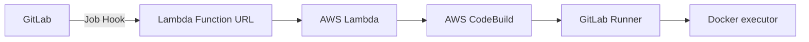

# aws-codebuild-gitlab-docker-runner

> https://x.com/ngyuki/status/1896168997693120865

CodeBuild の素では Shell executor しか実行できないので、自前で GitLab WehHook を仕込んで、次の経路で Docker executor を実行する。



terraform gitlab provider を使うために terraform 実行時に GITLAB_TOKEN を環境変数に入れておく必要あり。

```sh
export GITLAB_TOKEN=abc123...
```

本来の CodeBuild Gitlab Self-managed Runner ではタグが `codebuild-<codebuild>-$CI_PROJECT_ID-$CI_PIPELINE_IID-$CI_JOB_NAME` のような形式で、
実行ごとに Runner が登録 → 削除されている。

試しに事前に Runner を登録しておいて、要求に応じて CodeBuild で gitlab-runner を実行するだけにしてみたところ、大丈夫そうなのでそのようにしている（AWS が敢えてそうしていないということはなにか理由があるかもしれない）。

なお、pending になった Job の tag_list を得るために Gitlab REST API を呼ぶためだけに terraform で Project Token を作成している。有効期限が最大 365 日なので定期的に terraform apply してトークンのローテートが必要。
